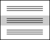

# Расстановка полей и отступов в CSS


В этой статье я хотел бы рассказать как правильно расставлять **поля** (`padding`) и **отступы** (`margin`) в CSS.

***

Прежде всего давайте вспомним определение полей и отступов согласно [спецификации W3C](http://www.w3.org/TR/CSS2/box.html#box-margin-area). В боксовой модели (`box model`) поля это расстояние между контентом (`content`) и границей блока (`border`). А отступы это расстояние между границей блока и границей соседнего или родительского элемента.

Таким образом если граница и фон элемента не заданы, то нет разницы использовать свойство padding или margin для задания отступов, но при условии, что ширина (`width`) и высота (`height`) элемента не заданы и не изменен алгоритм расчета размеров контента с помощью [свойства box-sizing](http://www.w3.org/TR/css3-ui/#box-sizing).

В любом случае следует помнить, что поля могут быть как включены в ширину или высоту элемента, так и нет. Отступы же всегда задаются снаружи элемента.

Теперь давайте рассмотрим как правильно расставлять поля и отступы между элементами. Возьмем в качестве примера следующий блок.


Это блок новостей `news`. Он состоит из заголовка, списка новостей и ссылки «Другие новости». Дадим им следующие названия классов: `news__title`, `news__list` и `news__more-link`.

```html
<div class="news">
    <h2 class="news__title">Новости</h2>
    <ul class="news__list">
        <li class="news__list-item">...</li>
        <li class="news__list-item">...</li>
        <li class="news__list-item">...</li>
    </ul>
    <p class="news__more-link"><a href="...">Другие новости</a></p>
</div>
```

Поскольку каждый из этих элементов имеет одинаковые отступы слева и справа, то лучше задать поля родительскому блоку, а не задавать отступы слева и справа для каждого элемента в отдельности.

```css
.news {
    padding: 20px 25px;
}
```

Таким образом при необходимости изменить значение полей справа и слева это нужно будет сделать *в одном месте*. А при добавлении нового элемента внутрь блока новостей, он уже будет иметь нужные отступы слева и справа.

***

Часто бывает так, что все элементы внутри блока имеют одинаковые отступы слева и справа, кроме одного, который вообще не должен иметь отступов, например, из-за фона. В этом случае для этого элемента можно задать относительное позиционирование и отрицательные отступы. Тогда не придется убирать поля внутри блока для остальных элементов.



***

Теперь нужно задать вертикальные отступы между элементами. Для этого следует определить какой из элементов является *обязательным*. Очевидно что блок новостей не может существовать без списка новостей, в тоже время ссылки «Другие новости» может и не быть, заголовок тоже может быть убран, например, при изменении дизайна.

Учитывая это, задаем для заголовка отступ снизу, а для ссылки «Другие новости» отступ сверху.

```css
.news__title {
    margin-bottom: 10px;
}

.news__more-link {
    margin-top: 12px;
}
```

Мы могли бы достигнуть такого же внешнего результата, добавив отступы сверху и снизу для списка новостей.

```css
.news__list {
    margin: 10px 0 12px 0;
}
```

Но в этом случае, при убирании ссылки «Другие новости» внизу остается лишний отступ. Тоже самое справедливо и для заголовка. Очевидно, что первый вариант является более правильным, поскольку позволяет гибко изменять внешний вид блока.

Теперь нужно задать отступы между отдельными новостями. Опять же нужно принять во внимание, что количество новостей может меняться, и в списке может быть только одна новость.

Можно задать для каждой новости кроме первой отступ сверху, либо для каждой новости кроме последней отступ снизу. Первый вариант более предпочтителен, поскольку псевдоселектор `:first-child` был добавлен [в&nbsp;спецификации CSS 2.1](http://www.w3.org/TR/CSS21/selector.html#first-child) и имеет более широкую поддержку, в отличие от псевдоселектора `:last-child`, который был добавлен только [в&nbsp;спецификации CSS версии 3.0](http://www.w3.org/TR/css3-selectors/#last-child-pseudo).

```css
.news__list-item {
    margin-top: 18px;
}

.news__list-item:first-child {
    margin-top: 0;
}
```

Таким образом, правильная расстановка полей и отступов позволяет гибко менять внешний вид любого блока, без внесения изменений в стили и без нарушений в дизайне. Самое главное это определить какие элементы блока являются основными (*обязательными*), а какие *опциональными*.

Иногда мы не можем опираться на обязательные элементы. Например, у нас есть всплывающее окошко `popup`, внутри которого может выводиться какой-то заголовок и текст. Причем в каких-то случаях может не быть текста, а в каких-то и заголовка. То есть оба элемента являются опциональными.


В этом случае можно использовать следующий способ задания отступов.

```css
.popup__header + .popup__text {
    margin-top: 15px;
}
```

https://jsfiddle.net/onfv42mz/1/

Тогда отступ появится только если будут использоваться оба элемента. В случае же вывода только заголовка или только текста, лишнего отступа не будет.

## Схлопывание вертикальных отступов

Еще один нюанс, о котором не все знают, связан с вертикальными отступами между соседними блоками. В определении отсупов, которое я приводил выше, сказано что отступ это расстояние между **границами** текущего и соседнего блока. Таким образом если мы расположим два блока друг под другом и зададим одному из них отступ снизу в `30px`, а другому отступ сверху в `20px`, отступ между ними будет не `50px`, а `30px`.

```css
.block1 {
    margin-bottom: 30px;
}

.block2 {
    margin-top: 20px;
}
```

https://jsfiddle.net/j99btnc8/


То есть произойдет наложение отступов, и отступ между блоками будет равен наибольшему отступу, а не сумме отступов. Этот эффект еще также называют "схлопыванием".

***
Прошу заметить, что горизонтальные отступы, в отличие от вертикальных не "схлопываются", а суммируются. Поля (`padding`) также суммируются.
***

Зная о "схлопывании" отступов, мы можем использовать эту особенность в свою пользу. Например, если нам необходимо расставить отступы для заголовков и текста внутри статьи, то для заголовка первого уровня зададим отступ снизу в `20px`, а для заголовка второго уровня отступ сверху `20px` и снизу `10px`, а для всех параграфов зададим отступ сверху `10px`.

```css
h1 {
    margin-bottom: 24px;
}

h2 {
    margin-top: 24px;
    margin-bottom: 12px;
}

p {
    margin-top: 12px;
}
```

https://jsfiddle.net/n27fms7s/1/

Теперь заголовок `h2` можно расположить как после заголовка `h1`, так и после параграфа. В любом случае отступ сверху не будет превышать `24px`.

## Общие правила

Подводя итог, я бы хотел перечислить правила, которых я придерживаюсь при расстановке полей и отступов. 

1. Если соседние элементы имеют одинаковые отступы, то лучше задавать их родительскому контейнеру, а не элементам.
2. При задании отступов между элементами, следует учитывать обязательный это элемент или опциональный.
3. Для списка однотипных элементов, не забывать о том, что число элементов может варьироваться.
4. Помнить о наложении вертикальных отступов, и использовать эту особенность там, где она принесет пользу.
