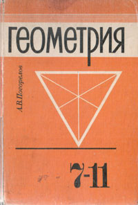
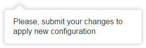
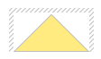
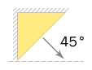
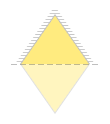
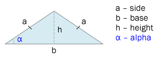
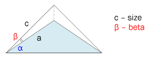

# Как я вспоминал школьный курс геометрии



Как часто вам приходилось решать дифференциальное уравнение или находить интеграл после окончания учебы? Думаю, нечасто, если, конечно, вы не ученый. Но есть дисциплины, теоретические знания по которым могут внезапно пригодиться нам в работе, даже если эта работа напрямую не связана с наукой. Одна из таких дисциплин &mdash; геометрия.

***

В этой статье я хочу рассказать о задаче, решить которую мне помогли геометрические формулы. И поскольку я занимаюсь разработкой интерфейсов, то речь пойдет о верстке вот такого всплывающего сообщения.



На первый взгляд ничего сложного. Быстро набрасываем основные стили, добавляем скругления и тень, а указатель в виде трегульника делаем с помощью псевдоэлемента и [широко известной техники](https://css-tricks.com/snippets/css/css-triangle/). Проверяем результат:

http://codepen.io/#1/

Все хорошо, вот только треугольник тоже должен быть с тенью. Но если мы добавим тень к нашему псевдоэлементу, то ничего не получится: тень будет квадратной.



http://codepen.io/#2/

Получается, что данный способ подходит только для создания простых треугольников, без тени и обводки.

Попробуем применить другую, чуть менее известную, технику созлания треугольников в CSS. Опять воспользуемся бордерами, только сделаем трегольник в левом верхнем углу, добавим элементу тень и сдвинем ее в тот же угол с помощью отрицательных значений. Теперь повернем элемент на 45 градусов по часовой стрелке &mdash; и получим трегуольник с тенью.



http://codepen.io/#3/

Результат выглядит уже лучше, но не идеально. Если присмотреться, то видно, что на макете трегольник чуть шире, чем у нас. И мы не сможем это исправить, поскольку наш треугольник всегда будет оставаться **прямогульным**. Мы можем добавить ему скругление, и даже сэмулировать обводку с помощью внутренней тени, но мы не можем изменить значение верхнего угла.

Для создания *не*прямоугольного треугольника воспользуемся более сложным способом. Суть его в том, что мы создаем квадрат, поворачиваем на 45 градусов и наклоняем на нужный угол, чтобы получить ромб, и затем скрываем его нижнюю часть. В результате получаем равнобедренный треугольник любых размеров, которому мы можем добавить тень, границу и скругление. 



Сложность заключается в том, что приходится вручную подбирать размеры квадрата и угол наклона пока не добьемся нужного вида. Поэтому многие этот способ и не используют. Так давайте напишем миксин, который будет делать все вычисления за нас!

## Пишем миксин

*Далее я буду использовать препроцессор LESS, но данный миксин можно легко переписать и на SCSS.*

Возьмем в качестве иллюстрации вот такой треугольник и зададим в качестве начальных параметров его размеры &mdash; основание `b` и высоту `h`.



Начнем вычисления с нахождения стороны `a`. Поскольку высота равнобедренного треугольника делит его основание пополам, то боковую сторону `a` можно найти по [теореме Пифагора](https://ru.wikipedia.org/wiki/%D0%A2%D0%B5%D0%BE%D1%80%D0%B5%D0%BC%D0%B0_%D0%9F%D0%B8%D1%84%D0%B0%D0%B3%D0%BE%D1%80%D0%B0):

```less
@base: 100px;
@height: 100px;
@side: sqrt(@base * @base / 4 + @height * @height); // про штаны, надеюсь все помнят ;)
```

Зная значения всех сторон, мы можем найти боковой угол `alpha`. Вспоминаем, что [синус угла](https://ru.wikipedia.org/wiki/%D0%A2%D1%80%D0%B8%D0%B3%D0%BE%D0%BD%D0%BE%D0%BC%D0%B5%D1%82%D1%80%D0%B8%D1%87%D0%B5%D1%81%D0%BA%D0%B8%D0%B5_%D1%84%D1%83%D0%BD%D0%BA%D1%86%D0%B8%D0%B8) есть отношение противолежащего катета к гипотенузе. Противолежащий катет у нас `h`, а гипотенуза &mdash; `a`. Таким образом:
 
```less
@alpha: asin(@height / @side); // результат будет в радианах!
```

Теперь необходимо вычислить угол наклона для трансформации нашего квадрата после поворота на **45** градусов. Для этого дорисуем прямоугольный треугольник, основание которого совпадает с нашим.



Теперь наглядно видно, что угол наклона `beta` будет равен разности между боковым углом `alpha` и углом поворота.

```less
@beta: convert(@alpha, deg) - 45deg; // не забываем перевести радианы обратно в градусы
```

Последнее значение, которое нам необходимо вычислить, это определить боковую сторону квадрата до его трансформации. Для этого воспользуеся [косинусом угла](https://ru.wikipedia.org/wiki/%D0%A2%D1%80%D0%B8%D0%B3%D0%BE%D0%BD%D0%BE%D0%BC%D0%B5%D1%82%D1%80%D0%B8%D1%87%D0%B5%D1%81%D0%BA%D0%B8%D0%B5_%D1%84%D1%83%D0%BD%D0%BA%D1%86%D0%B8%D0%B8#.D0.9E.D0.BF.D1.80.D0.B5.D0.B4.D0.B5.D0.BB.D0.B5.D0.BD.D0.B8.D0.B5_.D1.82.D1.80.D0.B8.D0.B3.D0.BE.D0.BD.D0.BE.D0.BC.D0.B5.D1.82.D1.80.D0.B8.D1.87.D0.B5.D1.81.D0.BA.D0.B8.D1.85_.D1.84.D1.83.D0.BD.D0.BA.D1.86.D0.B8.D0.B9_.D0.B4.D0.BB.D1.8F_.D0.BE.D1.81.D1.82.D1.80.D1.8B.D1.85_.D1.83.D0.B3.D0.BB.D0.BE.D0.B2). Угол наклона нам известен, а прилежажим катетом будет являться сторона `a`. Таким образом, боковую сторону можно вычислить по формуле:

```less
@size: @side * cos(@beta);
```

Теперь мы знаем исходные размеры квадрата, а также углы поворота и наклона, для трансформации его в ромб. Добавляем необходимые стили и скрываем нижнюю половинку ромба с помощью `overflow: hidden`, в результате получаем равнобедренный трегольник заданных размеров. Миксин готов. 

[http://codepen.io/belyan/pen/wozWXE](http://codepen.io/belyan/pen/wozWXE)

Применяем его к нашему всплывающему сообщению и получаем наконец желаемый результат. :)

http://codepen.io/#4/
 
Хочу добавить, что с помощью этого же миксина мы можем создавать и равносторонние треугольники, поскольку они являются частным случае равнобедренных. В этом случае нам достаточно будет задать только основание треугольника, а его высоту можно легко вычислить по формуле: `@height: @base * sin(60deg);`.

Также можно добавить в миксин возможность задания направления вершины трегольника: `top`, `left`, `right`, `bottom`. Я не стал этого делать в статье, поскольку объем кода существенно увеличился бы. Тем же, кому интересна эта тема, предлагаю взглянуть на расширенную версию данного миксина. Там же вы найдете миксины и для других геометрических фигур, таких как круг, овал, крест, звезда и пр.

[http://codepen.io/belyan/pen/Lpqdmx](http://codepen.io/belyan/pen/Lpqdmx)

Надеюсь, вам было интересно. Спасибо за внимание!
