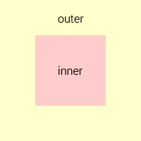

# Все способы вертикального выравнивания в CSS


Я думаю, многие из вас, кому приходилось заниматься версткой, сталкивались с необходимостью выравнивать элементы по вертикали и знают, какие сложности возникают при выравнивании элемента по центру.

Да, для вертикального выравнивания в CSS есть специальное свойство `vertical-align` [с множеством значений](http://www.w3.org/TR/CSS2/visudet.html#propdef-vertical-align). Однако на практике оно работает совсем не так, как ожидается. Давайте попробуем в этом разобраться.

***

Сравним следующие подходы. Выравнивание с помощью:  
* таблицы, 
* отступов, 
* `line-height`, 
* растягивания,  
* отрицательного `margin`,
* `transform`,
* псевдоэлемента,
* `flexbox`.

В качестве иллюстрации рассмотрим следующий пример.



Есть два элемента `div`, при этом один из них вложен в другой. Дадим им соответствующие классы &mdash; `outer` и `inner`.

```html
<div class="outer">
    <div class="inner"></div>
</div>
```

Задача состоит в том, чтобы выровнять внутренний элемент по центру внешнего элемента.

Для начала рассмотрим случай, когда размеры внешнего и внутреннего блока **известны**. Добавим внутреннему элементу правило `display: inline-block`, а внешнему &mdash; `text-align: center` и `vertical-align: middle`.

Нпомню, что выравнивание применяется только к элементам, которые имеют режим отображения `inline` или `inline-block`.

Зададим блокам размеры, а также фоновые цвета, чтобы видеть их границы.

```css
.outer {
    width: 200px;
    height: 200px;
    text-align: center;
    vertical-align: middle;
    background-color: #ffc;
}
.inner {
    display: inline-block;
    width: 100px;
    height: 100px;
    background-color: #fcc;
}
```

После применения стилей мы увидим, что внутренний блок выровнялся по горизонтали, а по вертикали нет:
http://jsfiddle.net/c1bgfffq/

*Почему так произошло?* Дело в том, что свойство `vertical-align` влияет на выравнивание **самого элемента, а не его содержимого** (кроме случаев, когда оно применяется к ячейкам таблицы). Поэтому применение данного свойства к внешнему элементу ничего не дало. Более того, применение этого свойства к внутреннему элементу также ничего не даст, поскольку строчные блоки (`inline-block`) выравниваются по вертикали относительно соседних блоков, а в нашем случае у нас один строчный блок.

Для решения данной проблемы существует несколько техник. Ниже подробнее рассмотрим каждую из них.

## Выравнивание с помощью таблицы

Первое приходящее на ум решение &mdash; заменить внешний блок таблицей из одной ячейки. В этом случае выравнивание будет применяться к содержимому ячейки, то есть к внутреннему блоку.

```html
<table class="outer-wrapper">
    <td class="outer">
        <div class="inner"></div>
    </td>
</table>
```
http://jsfiddle.net/c1bgfffq/1/

Очевидный минус данного решения – с точки зрения семантики неправильно применять таблицы для выравнивания. Второй минус в том, что для создания таблицы требуется добавить еще один элемент вокруг внешнего блока.

Первый минус можно частично убрать, заменив теги `table` и `td` на `div` и задав табличный режим отображения в CSS.

```html
<div class="outer-wrapper">
    <div class="outer">
        <div class="inner"></div>
    </div>
</div>
```
```css
.outer-wrapper {
    display: table;
}

.outer {
    display: table-cell;
}
```

Тем не менее внешний блок все равно останется таблицей со всеми вытекающими из этого последствиями.

## Выравнивание с помощью отступов

Если высоты внутреннего и внешнего блока известны, то выравнивание можно задать с помощью вертикальных отступов у внутреннего блока, используя формулу: (H<sub>outer</sub> – H<sub>inner</sub>) / 2.
```css
.outer {
    height: 200px;
}

.inner {
    height: 100px;
    margin: 50px 0;
}
```
http://jsfiddle.net/c1bgfffq/6/

Минус решения - оно применимо лишь в ограниченном числе случаев, когда известны высоты обоих блоков.

## Выравнивание с помощью line-height

Если известно, что внутренний блок должен занимать не более одной строки текста, то можно воспользоваться свойством `line-height` и задать его равным высоте внешнего блока. Поскольку контент внутреннего блока не должен переноситься на вторую строку, рекомендуется также добавить правила `white-space: nowrap` и `overflow: hidden`.

```css
.outer {
    height: 200px;
    line-height: 200px;
}

.inner {
    white-space: nowrap;
    overflow: hidden;
}
```
http://jsfiddle.net/c1bgfffq/12/

Также данную технику можно применять и для выравнивания многострочного текста, если для внутреннего блока переопределить значение `line-height`, а также добавить правила `display: inline-block` и `vertical-align: middle`.

```css
.outer {
    height: 200px;
    line-height: 200px;
}

.inner {
    line-height: normal;
    display: inline-block;
    vertical-align: middle;
}
```
http://jsfiddle.net/c1bgfffq/15/

Минус данного способа заключается в том, что должна быть известна высота внешнего блока.

## Выравнивание с помощью "растягивания"

Данный способ можно применять, когда высота внешнего блока неизвестна, но известна высота внутреннего. 

Для этого нужно:
1. задать внешнему блоку относительное позиционирование, а внутреннему &mdash; абсолютное;
2. добавить внутреннему блоку правила `top: 0` и `bottom: 0`, в результате чего он растянется на всю высоту внешнего блока;
3. установить значение `auto` для вертикальных отступов внутреннего блока.

```css
.outer {
    position: relative;
}

.inner {
    height: 100px;
    position: absolute;
    top: 0;
    bottom: 0;
    margin: auto 0;
}
```
http://jsfiddle.net/c1bgfffq/4/ 

Суть этой техники заключается в том, что задание высоты для растянутого и абсолютно спозиционированного блока заставляет браузер вычислять вертикальные отступы в равном соотношении, если их значение установлено в `auto`.

http://www.w3.org/TR/CSS2/visudet.html#abs-non-replaced-height

Минус данного способа - должна быть известна высота внутреннего блока.

## Выравнивание с помощью отрицательного margin-top

Этот способ получил широкую известность и применяется очень часто. Как и предыдущий, он применяется, когда высота внешнего блока неизвестна, но известна высота внутреннего. 

Нужно задать внешнему блоку относительное позиционирование, а внутреннему &mdash; абсолютное. Затем необходимо сдвинуть внутренний блок вниз на половину высоты внешнего блока `top: 50%` и поднять вверх на половину собственной высоты `margin-top`: -H<sub>inner</sub> / 2.

```css
.outer {
    position: relative;
}

.inner {
    height: 100px;
    position: absolute;
    top: 50%;
    margin-top: -50px;
}
```
http://jsfiddle.net/c1bgfffq/13/ 

Минус данного способа  - должна быть известна высота внутреннего блока.

## Выравнивание с помощью transform

Данный способ похож на предыдущий, но он может быть применен, когда высота внутреннего блока неизвестна. В этом случае вместо задания отрицательного отступа в пикселях можно воспользоваться свойством `transform` и поднять внутренний блок вверх с помощью функции `translateY` и значения `-50%`.

```css
.outer {
    position: relative;
}

.inner {
    position: absolute;
    top: 50%;
    transform: translateY(-50%);
}
```
http://jsfiddle.net/c1bgfffq/9/ 

Почему в предыдущем способе нельзя было задать значение в процентах? Так как процентные значения свойства `margin` вычисляются относительно родительского элемента, значение в 50% равнялось бы половине высоты внешнего блока, а нам нужно было поднять внутренний блок на половину его собственной высоты. Для этого как раз подходит свойство `transform`.

Минус данного способа в [ограниченной поддержке](http://caniuse.com/#feat=transforms2d) свойства `transform` старыми версиями браузера IE.

## Выравнивание с помощью псевдоэлемента

Это наиболее универсальный способ, который может применяться, когда неизвестны высоты обоих блоков. 

Суть способа  в добавлении внутри внешнего блока строчного блока `inline-block` высотой в `100%` и задания ему вертикального выравнивания. В этом случае высота добавленного блока будет равна высоте внешнего блока. Внутренний блок выровняется по вертикали относительно добавленного, а значит, и внешнего блока.

Чтобы не нарушать семантику, строчный блок рекомендуется добавить с помощью псевдоэлемента `before` или `after`.

```css
.outer:before {
    display: inline-block;
    height: 100%;
    vertical-align: middle;
    content: "";
}

.inner {
    display: inline-block;
    vertical-align: middle;
}
```
http://jsfiddle.net/c1bgfffq/10/

Минус данного способа - он не может быть применен, если внутренний блок имеет абсолютное позиционирование.

## Выравнивание с помощью Flexbox

Самый современный способ вертикального выравнивания это использовать [Flexible Box Layout](http://www.w3.org/TR/css3-flexbox/) (в народе известен как `Flexbox`). Данный модуль позволяет гибко управлять позиционированием элементов на странице, располагая их практически как угодно. Выравнивание по центру для Flexbox &mdash; очень простая задача.

Внешнему блоку необходимо задать `display: flex`, а внутреннему &mdash; `margin: auto`. И это все! Красиво, правда?

```css
.outer {
    display: flex;
    width: 200px;
    height: 200px;
}

.inner {
    width: 100px;
    margin: auto;
}
```
http://jsfiddle.net/c1bgfffq/14/

Минус данного способа &mdash; Flexbox [поддерживается](http://caniuse.com/#feat=flexbox) только современными браузерами.

## Какой способ выбрать?

Нужно исходить из постановки задачи: 
* Для вертикального выравнивания текста лучше использовать вертикальные отступы или свойство `line-height`. 
* Для абсолютно позиционированных элементов с известной высотой (например, иконок) идеально подойдет способ с отрицательным свойством `margin-top`. 
* Для более сложных случаев, когда неизвестна высота блока, нужно использовать псевдоэлемент или свойство `transform`. 
* Ну а если вам повезло настолько, что не нужно поддерживать старые версии браузера IE, то, конечно, лучше использовать `Flexbox`.